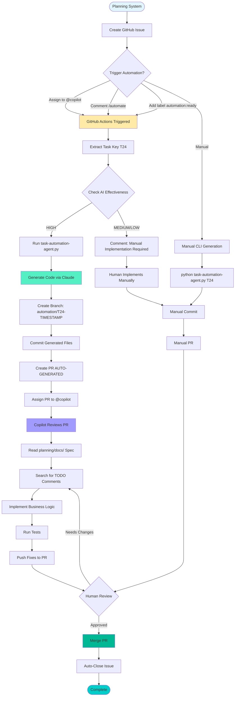
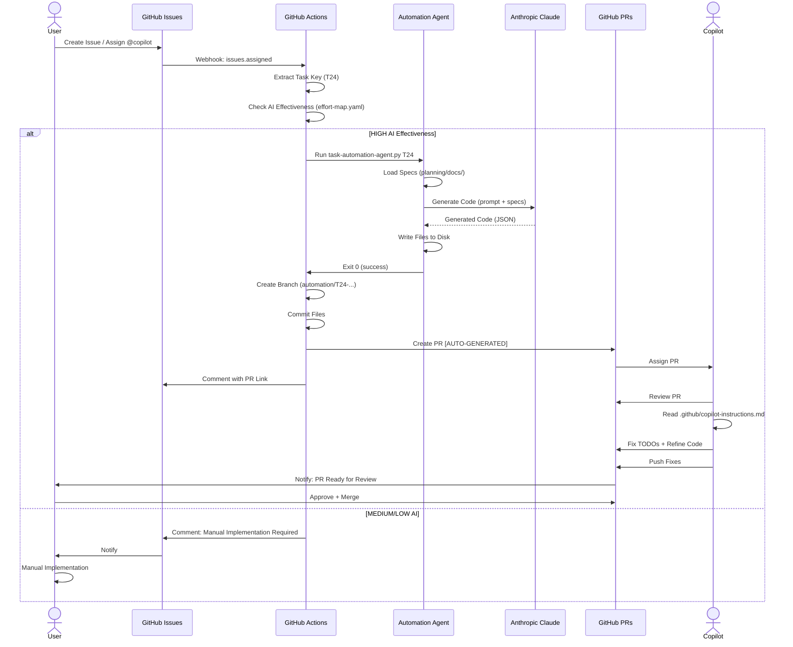
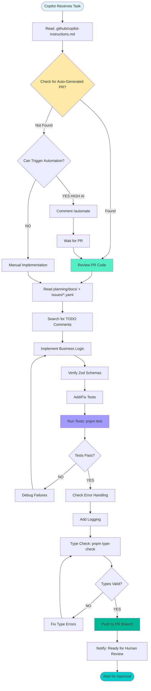
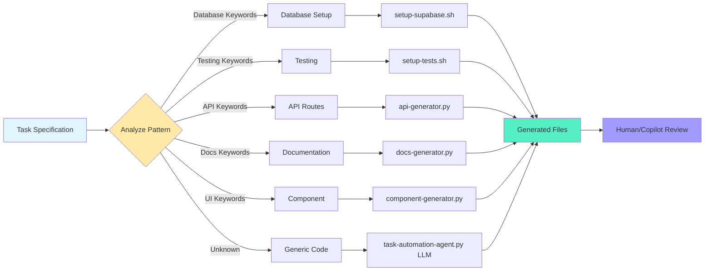
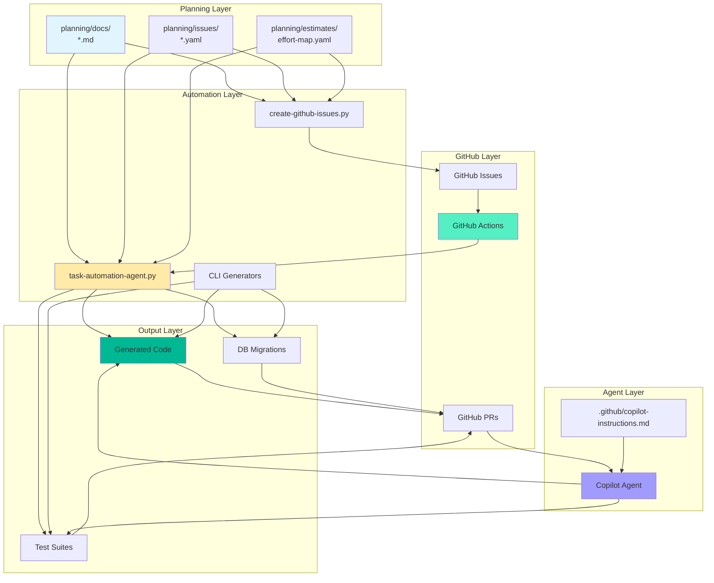
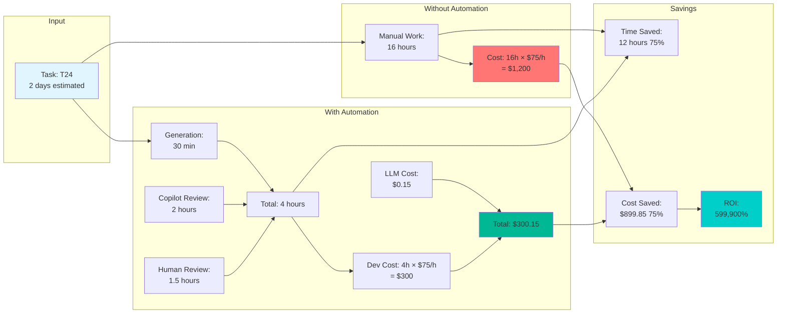
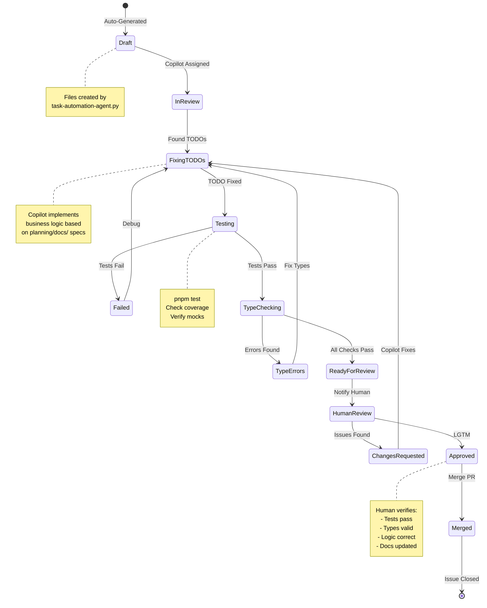
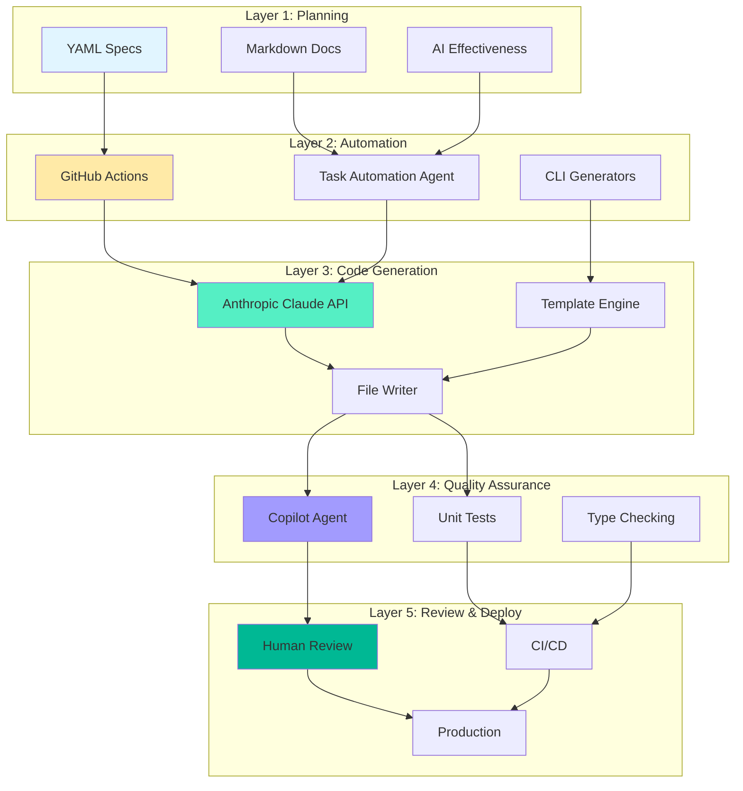

# Copilot + Automation Workflow Diagrams

## Complete End-to-End Flow

## GitHub Actions Workflow Detail

## Copilot Agent Decision Flow

## Task Pattern Recognition

## Data Flow

## Cost-Benefit Analysis Flow

## State Machine: PR Lifecycle

## Architecture Layers

---

**Visual Reference**: Use these diagrams to understand the complete automation workflow.

**Tools**: Render these with any Mermaid-compatible tool (GitHub, VS Code, online viewers).

**Version**: 1.0.0

**Last Updated**: 2026-02-08
