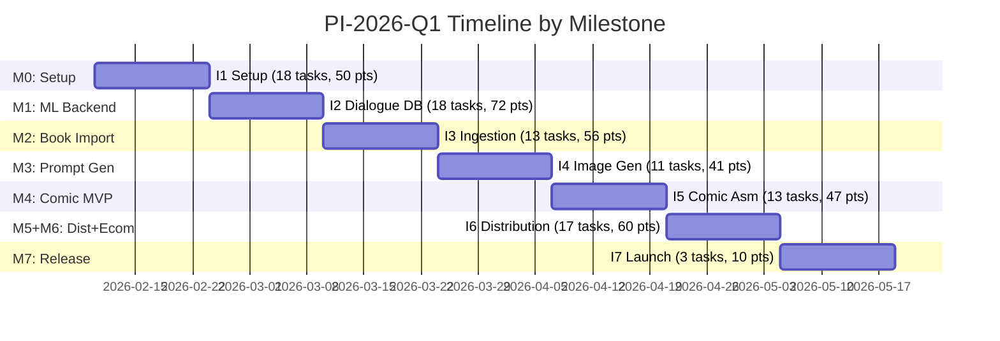
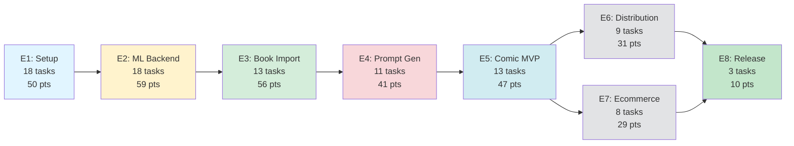
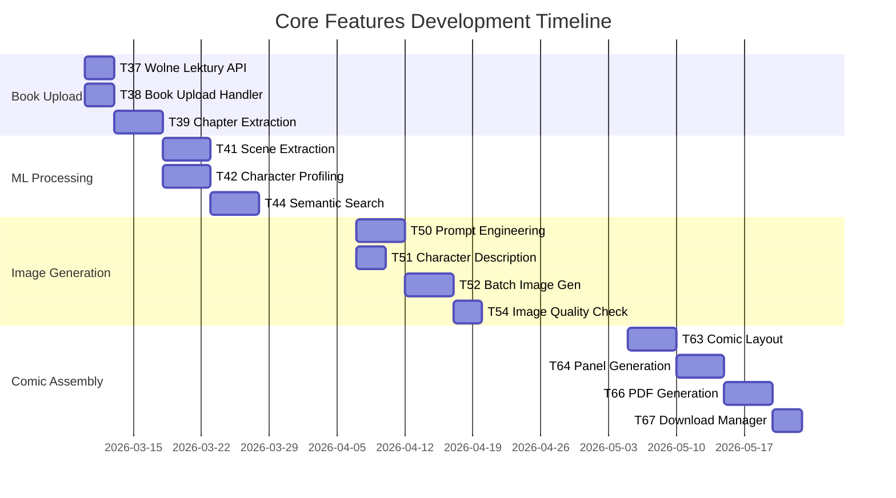
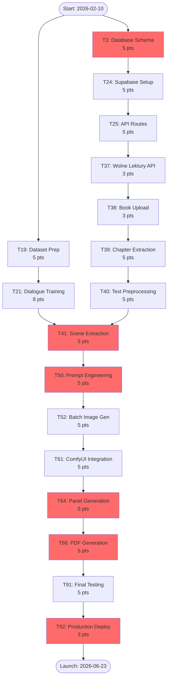
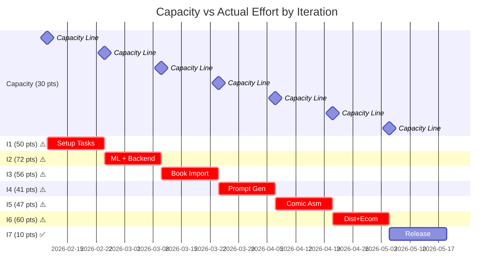
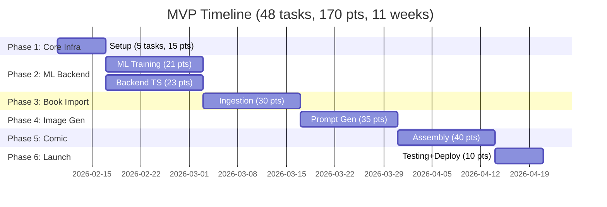
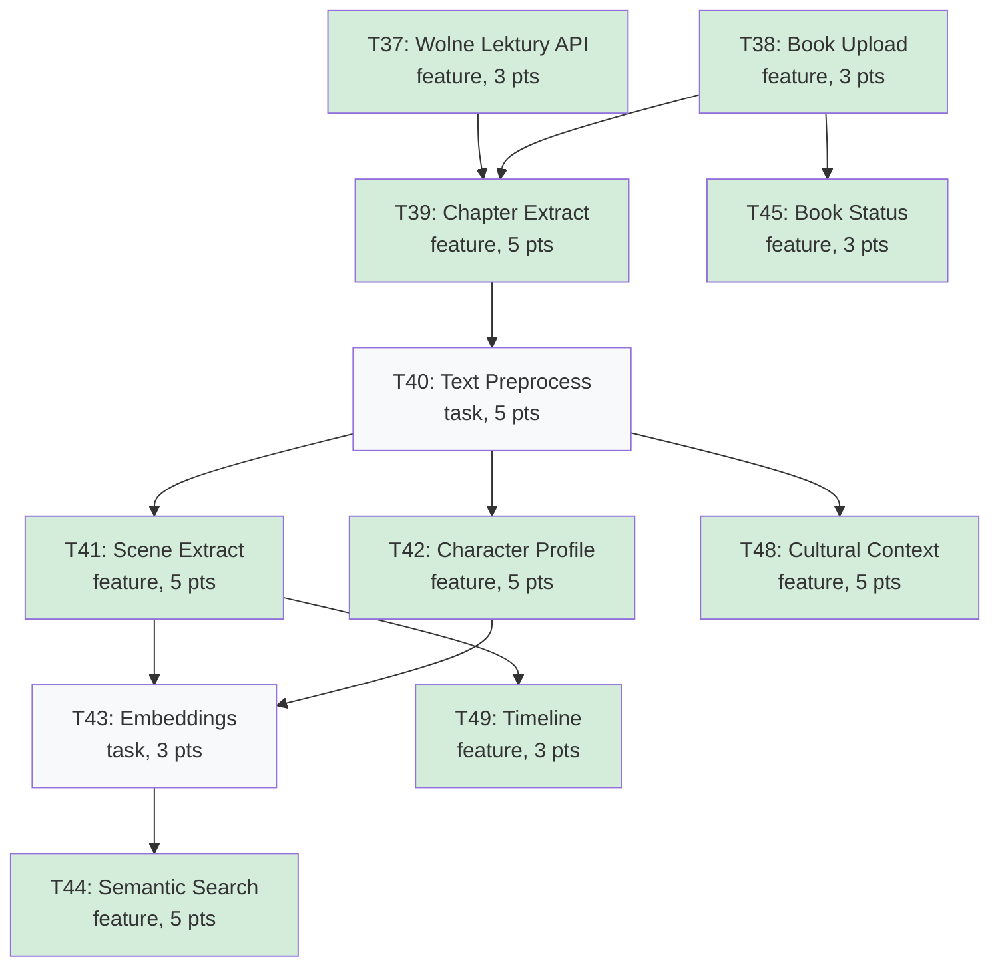

# PI-2026-Q1 Gantt Chart & Dependency Graph

**Generated:** 2026-02-07 **Timeline:** 2026-02-10 to 2026-06-23 (19 weeks, 7
iterations)

---

## 📅 Timeline Overview (Iteracje)

---

## 🏗️ Epic Dependencies (High-Level)

---

## 📦 Feature Timeline (Core Value Props)

---

## 🔄 Critical Path Analysis

**Longest dependency chain (Critical Path):**

**Critical Path Duration:** ~75 effort points on critical dependencies

---

## 📊 Resource Allocation by Iteration

**⚠️ Wszystkie iteracje (poza I7) przekraczają capacity 30 pts!**

---

## 🎯 MVP Recommendation (Simplified)

**Zredukowany do 48 tasków, ~170 punktów:**

**Total MVP: 11 tygodni (2.5 miesiąca) zamiast 19 tygodni (4.5 miesiąca)**

---

## 📈 Capacity Analysis

| Iteration | Planned | Capacity | Over | % Over   |
| --------- | ------- | -------- | ---- | -------- |
| **I1**    | 50 pts  | 30 pts   | +20  | +67% ⚠️  |
| **I2**    | 72 pts  | 30 pts   | +42  | +140% 🚨 |
| **I3**    | 56 pts  | 30 pts   | +26  | +87% ⚠️  |
| **I4**    | 41 pts  | 30 pts   | +11  | +37% ⚠️  |
| **I5**    | 47 pts  | 30 pts   | +17  | +57% ⚠️  |
| **I6**    | 60 pts  | 30 pts   | +30  | +100% 🚨 |
| **I7**    | 10 pts  | 30 pts   | -20  | -67% ✅  |
| **Total** | 333 pts | 210 pts  | +123 | +59%     |

**Rozwiązania:**

1. Zwiększ capacity: 30 → 50 pts/iteracja (2 devs)
2. Rozciągnij timeline: 7 → 11 iteracji (22 tygodnie)
3. Usuń features: 333 → 170 pts MVP (7 iteracji zostaje)

---

## 🔗 Task Dependencies (Sample - E3 Book Import)

**Legend:**

- 🟢 Green = Feature (user-facing)
- ⚪ Gray = Task (infrastructure)

---

## 💡 Quick Stats

- **Total Duration:** 19 weeks (133 days)
- **Start Date:** 2026-02-10
- **Target Launch:** 2026-06-23
- **Total Effort:** 333 points
- **Avg per Iteration:** 47.6 pts (59% over capacity)
- **Critical Path:** ~75 pts (depends on
  T3→T24→T25→T38→T39→T40→T41→T50→T52→T61→T64→T66→T92)

**Recommendations:**

1. 🚨 Zwiększ team size (2 devs @ 30 pts = 60 pts/iteracja)
2. ⚠️ Lub upraszczaj do MVP (usuń E6, E7, połowa E1)
3. ✅ Lub rozciągnij timeline do 22 tygodni

---

**Więcej szczegółów:**

- [planning/pi.yaml](pi.yaml) - Single source of truth
- [planning/pi-tree.md](pi-tree.md) - Hierarchia tasków
- [planning/pi-schedule.md](pi-schedule.md) - Podział na iteracje
- [planning/PI_ANALYSIS.md](PI_ANALYSIS.md) - Analiza MVP
